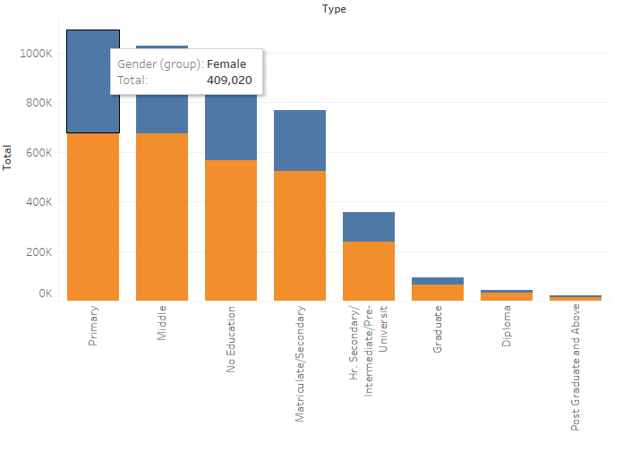
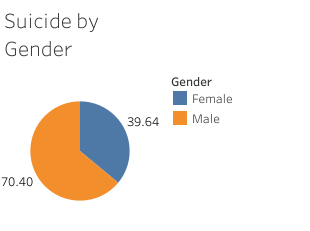
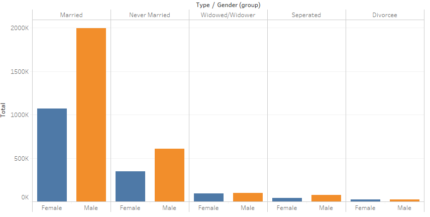
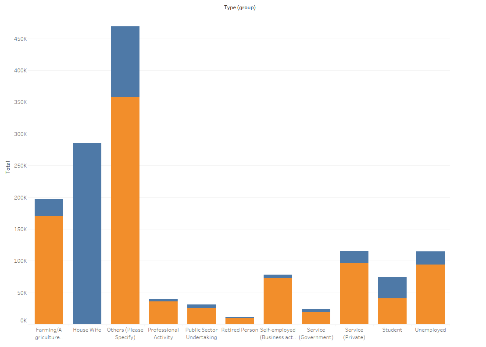
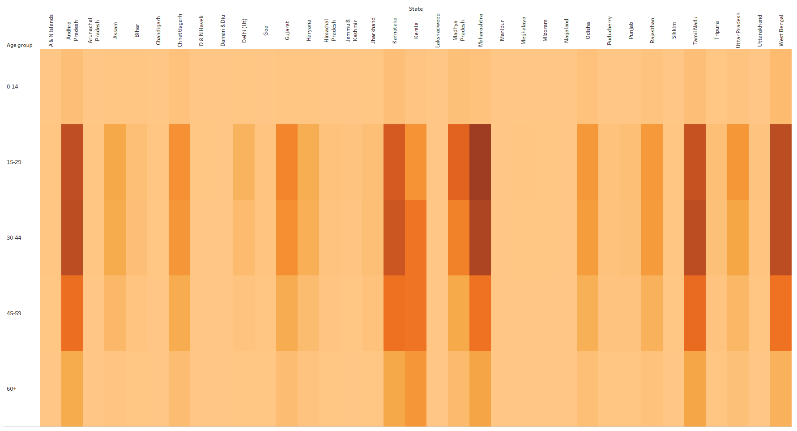
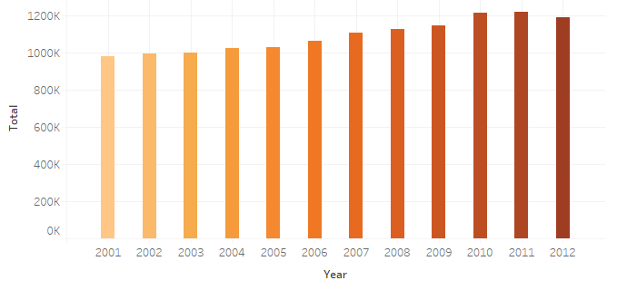

# Suicide Rate in India between 2001-2013
https://public.tableau.com/profile/mdptl#!/vizhome/SuicideRateinIndiabetween2001-2013/Dashboard1

An exploratory data analysis and understanding the ethical implications in data science. This project was a practice in understanding the biases and data discrimination in the data model. The first step is awareness and hopefully the above list will help you and your colleagues. If you know about bias, you can remain alert to it in your own work and that of others. Be critical and always challenge assumptions and designs. Recognising the types of bias, and understanding their impact on your conclusions will make you a better Data Scientist and improve the quality of your conclusions.

But before we get started, I'd like talk about my thought process and the motivation behind this dataset. Being Indian, I am curious about what's happening in India via the news media outlets. There seems to be a rise of farmer suicides and rapes of young girls. This got me wondering about the trend of suicides in India. With having 1.3 billion people living in India, it's no wonder that suicide rate will be extremely high. But in what category? Gender? Age group? and more specifically, the social status.  

I found this dataset on Kaggle via https://www.kaggle.com/rajanand/suicides-in-india 

What I found was quite the opposite! Although, the dataset is bit outdated, it still does represent a bit of the trend in present day. 

Hope you find this useful and I am always looking for feedbacks! Let's explore the dataset!

Dataset from the Kaggle link above contains data of suicide counts across the states of India, Age group, Gender, Year, Social status, Professional status, and the means adopted.

# My findings
 

## 1. Distribution of suicides according to Educational status and Gender
The number of suicides appeared to be concentrated toward those in Primary and Secondary including those with no education. This could perhap indicate those with lower social status tend to have lower education levels and possibly due to academic pressure to do well. 

 

## 2. Distribution of number of suicides on the basis of social status
This was interesting because societal norms would indicate that a married couple who are happy and have healthy family dynamic would be less likely to commit suicide. This dataset showed otherwise. While most of the causes of the suicides are not known, the three major causes among the known cases are family problems, prolonged illness and mental illness.

 

## 3. #2 made me want to look into the married couple data. I found that housewives are the major victims in suicide!  
This could be due to dowry disputes. This could be due to the fact that there are lower representation by women in professional careers, and also iterates the importance of female education and women empowerment. This image showed that financially independent women are much more mentally stronger.

 

## 4. What about farmers?
It's really disheartening to see farmers who helped feed the country are the highest victims in suicide than any other profession.

 

## 5. According to the data below, we can see that 15-29 is the most vulnerable age in all states except Kerala.

 

## 6. The trend of suicide rate is increasing with time. The percentage increase in suicide is 24.8% between 2001 to 2012. 

 

I believe that suicide rate can be decreased if we implement preventive measures especially in education and professional setting. Mental illness is a taboo in South Asian culture. It's nothing to be ashamed of to seek help and discuss issues. Suicide or ending one’s own life is a tragic event with strong emotional repercussions for its survivors and for families of its victims. 
